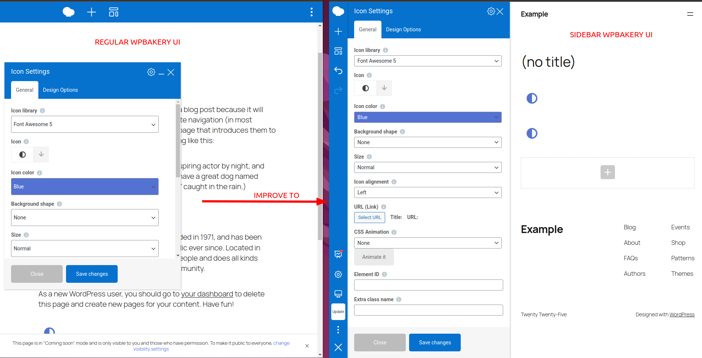

# Sidebar for WPBakery Page Builder

Customizable UI for WPBakery Page Builder with sidebar navigation and panels.

Enhance your WPBakery Page Builder experience with a sleek, customizable sidebar for effortless navigation and improved workflow.

This lightweight and user-friendly plugin adds a persistent navigation bar and panels as a sidebar, ensuring quick access to essential WPBakery features without obstructing your content. No more dragging or resizing panels—just a seamless editing experience.

With intuitive controls, the sidebar streamlines access to elements, settings, and the page structure, making the Frontend Editor more efficient. Plus, a dedicated settings page lets you tailor the sidebar’s appearance and behavior to suit your preferences.

Boost your productivity and enjoy a cleaner, more efficient WPBakery Page Builder interface.

## Key Features

* Sidebar navigation bar for quick access to panels.
* Panels as a sidebar for easy access to settings.
* Resizable sidebar panels width for a personalized experience.
* Ability to close notification messages for a cleaner interface.
* Ability to scroll to the element in the Edit Form panel for quick navigation.
* Settings page for customizing the sidebar's appearance and behavior.
  * Hide the description under elements in the Add Element panel.
  * Reduce spacing between elements in the Add Element panel for a more compact view.
  * Reduce fields size and spacing in the Edit Form/Settings panel for a more compact view.
  * Make the page view area shrink or stay the same width when the sidebar is opened.
  * Set sidebar position to the right.
  * Page Structure panel for a quick overview of the page's structure.

## Installation
The plugin is available on the [WordPress plugin repository](https://wordpress.org/plugins/sidebar-navigation-for-wpbakery/). You can install it directly from the WordPress dashboard.
or
You can directly install the plugin from the GitHub repository.
1. Upload the plugin folder to your /wp-content/plugins/ folder.
2. Go to the **Plugins** page and activate the plugin.

That's it. Right now if you go to the WPBakery Page Builder frontend editor you can enjoy new sidebar UI.

## Requirements
1. WPBakery Page Builder version 8.0+
2. PHP version 7.0+
3. WordPress version 6.4+

## Frequently Asked Questions

### How do I activate the sidebar?

Simply activate the plugin and edit any post/page using WPBakery Page Builder’s Frontend Editor.

### Where does the sidebar appear?

By default, the sidebar appears on the left side of the WPBakery Page Builder interface. You can change it to the right in the settings.

### Can I customize the sidebar?

Yes! The settings page allows you to tweak sidebar positioning, spacing, and visibility preferences.

### Where do I find the plugin settings?

Navigate to **Settings > Sidebar for WPBakery Page Builder** in your WordPress dashboard.

### How do I disable the sidebar?

Deactivate the plugin via the WordPress **Plugins** page.

## Code of Conduct

Please read and follow the [Code of Conduct](./CODE_OF_CONDUCT.md).

## Contributing

This project is open for contributions. Read the [contributing guide](./CONTRIBUTING.md) to learn about development process. How to integrate your changes to Sidebar for WPBakery.

## License

Sidebar for WPBakery Page Builder is [GPLv3 licensed](./LICENSE).

## 💙 Support This Project

Thank you for using **Sidebar for WPBakery Page Builder**! Your support helps keep this project active and maintained. Here are some ways you can contribute:

### ⭐ Star This Repository
Show your appreciation by starring this repository on GitHub. It helps others discover the project and motivates ongoing development.

### 🛠 Contribute
Help improve the project by submitting issues, feature requests, or pull requests. Whether it’s fixing bugs, improving documentation, or adding new features, every contribution counts!

### 📢 Share on Social Media
Spread the word! Share this project on Twitter, LinkedIn, Facebook, or any other platform to help more people find and use it.

### 🌟 Rate in the WordPress Repository
If you're using this plugin on WordPress, please consider leaving a rating and review in the [WordPress Plugin Repository](https://wordpress.org/plugins/sidebar-navigation-for-wpbakery/). Positive feedback helps others trust and adopt the plugin.

Your support makes a difference—thank you! 🚀
