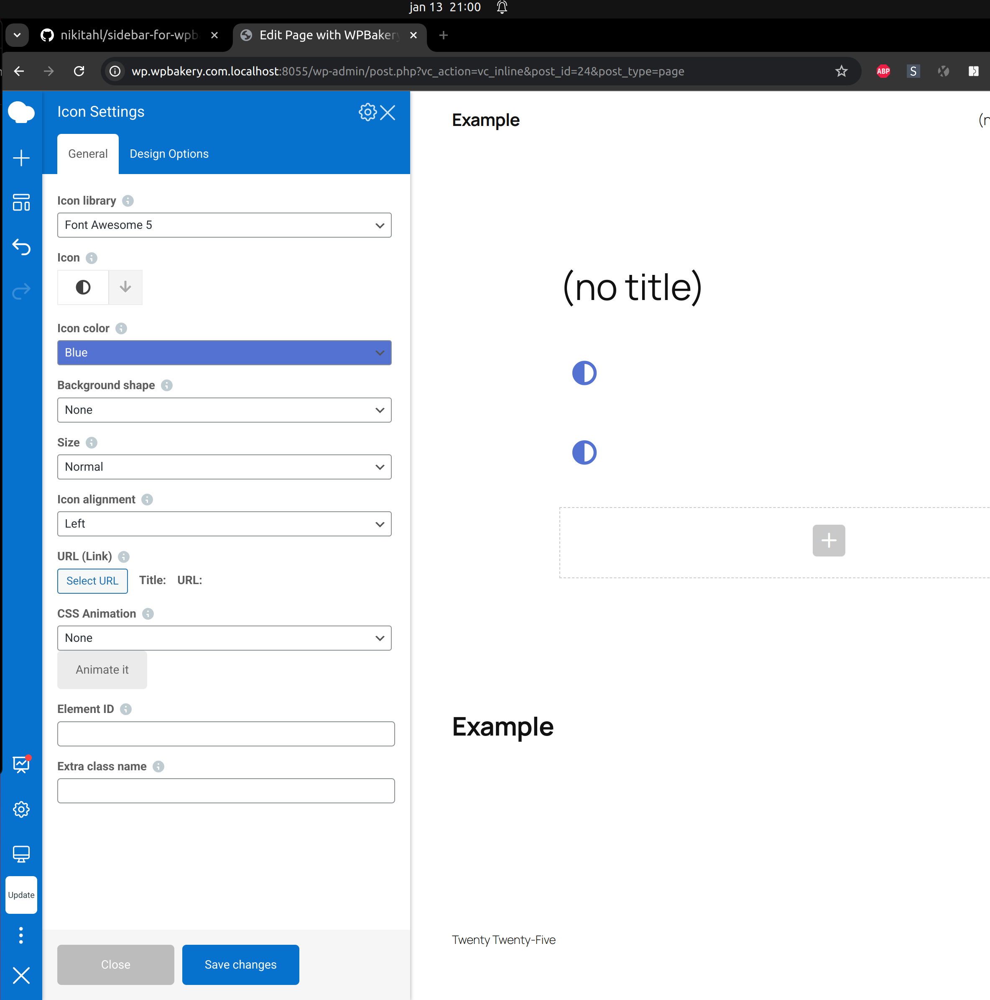

## Description

This is WordPress plugin that display a navigation and panels as a sidebar in WPBakery Page Builder.

## Installation
You can directly install the plugin from the GitHub repository.
1. Upload the plugin folder to your /wp-content/plugins/ folder.
2. Go to the **Plugins** page and activate the plugin.

That's it. Right now if you go to WPBakery Page Builder frontend editor you can enjoy new sidebar UI.

## Requirements
1. WPBakery Page Builder version 8.0+
2. PHP version 7.0+
3. Wordpress version 6.4+

## Frequently Asked Questions
1. WPBakery Page Builder version 8.0+
2. PHP version 7.0+
3. Wordpress version 6.4+

### How do I use this plugin?

To use the plugin, you just need to activate it. And edit any post/page with the WPBakery Page Builder.

### Where do I see the sidebar?

The navigation bar will be displayed as a sidebar on the left side of the screen in the WPBakery Page Builder's Frontend Editor.

### How do I disable the sidebar?

To disable the sidebar in WPBakery, just deactivate the plugin via the Plugins page in the WordPress dashboard.
